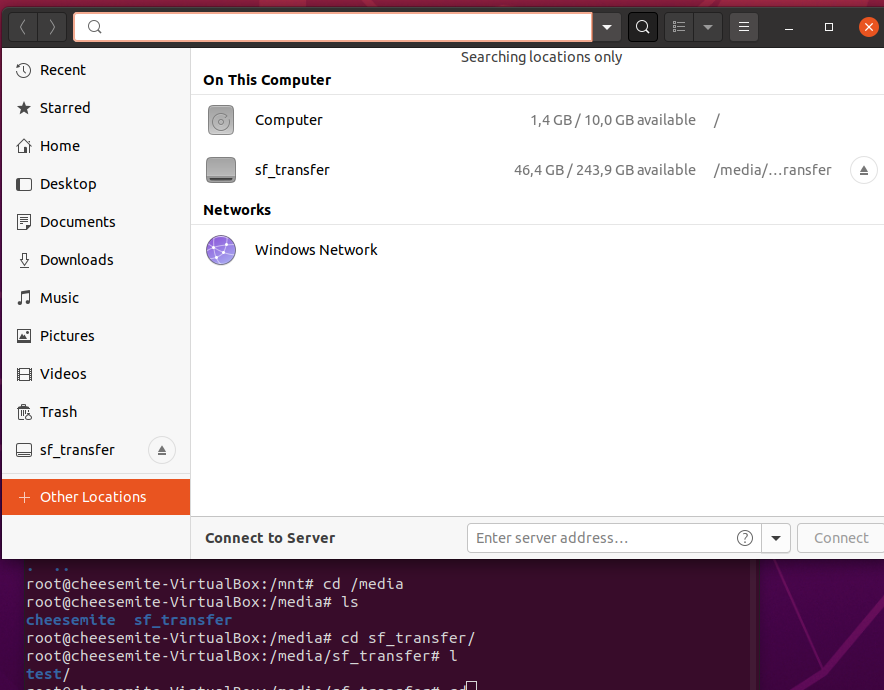

# Work with VirtualBox
I skipped first steps, as I already have machine with ubuntu.

Clone the existing machine  
  
And here we have the new machine  
  
Rename each machine according to requirments  
  
Create group  
  
Create some snapshots  
  
Export machine  
  
Import machine  
  
Result of import  
  
Work with usb :)  
  
Configure shared folder  
  
  
## Some demonstation of testing different network types  
#### Nat network  
  
  
#### Bridged adapter  
  
  
## Work with Vagrant  
  

Connect using MobaXterm  
  
  

VagrantBox can be created by ```vagrant package```command. Example of creating VagrantBox by machine from VirtualBox.  
  