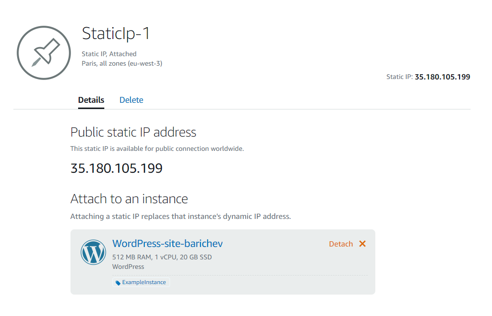
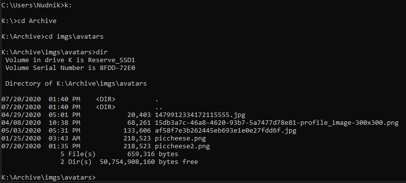

 

[WordPress example site](http://cheesemite.tech/)  
[My static site in S3](http://barichev.s3-website-us-east-1.amazonaws.com/)  

# Work with Lightsail  
Created instance  
  

Connected by MoboXterm using ssh key  
  

By console  
  

# Work with S3  
Create bucket  
  
Upload file  
  
Download file  
  
Delete file  
  
Delete bucket   
  
# Own site by LightSail  
Created WordPress instance  
  
Login to admin-panel  
  
  
Test availability of site  
  
Attach static ip to an instance  
  
Configure DNS  
  
Test domain  

# Work with IAM and S3  
  
  
  
  
  
  
