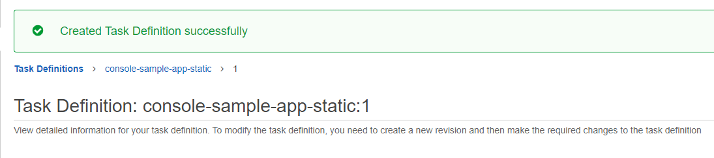

According to this guide : [Getting started with Amazon ECS using Amazon EC2](https://docs.aws.amazon.com/AmazonECS/latest/developerguide/getting-started-ecs-ec2.html)

# Containers and AWS
Created task definition  
  

Created cluster  
  

Created service  
  
  

Find public IP  
  

See the result  

Delete both service and cluster  
  
  