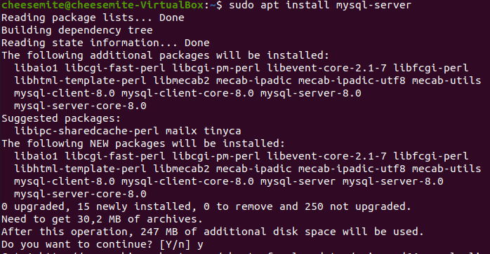
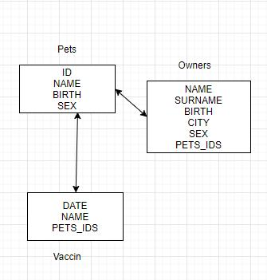
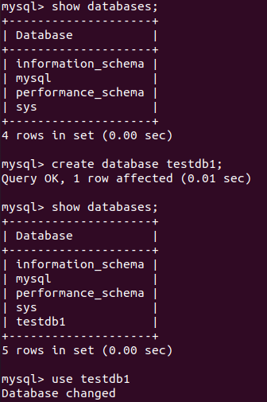
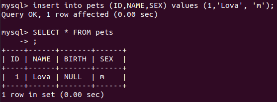
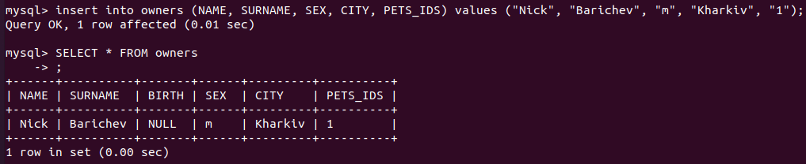
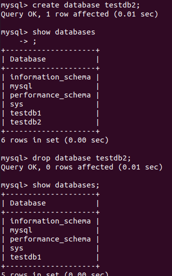
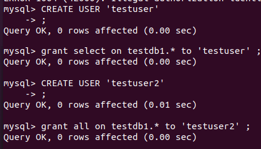
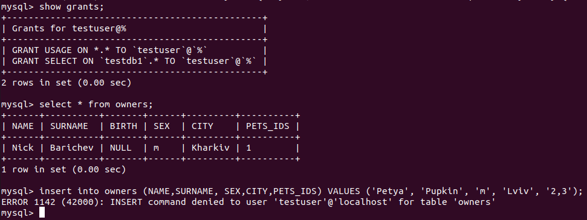
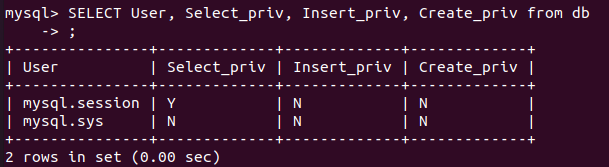
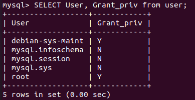

# Task3.1

## Installed ```MySQL Server ``` 

  

## Database schema
  

## Created database and swiched to it
  

## Created tables
  

  

Created other tables by the same way :  
  

## Inserted info
  

  

## Created/Deleted database
  

## Tested user privalages  
  

switched user
```console
# mysql -u testuser
```
  

## Made selections from the mysql db
  

  