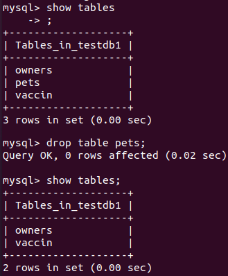
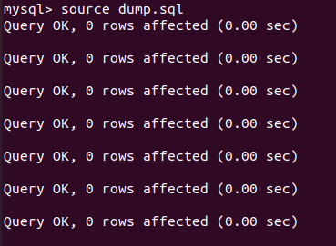
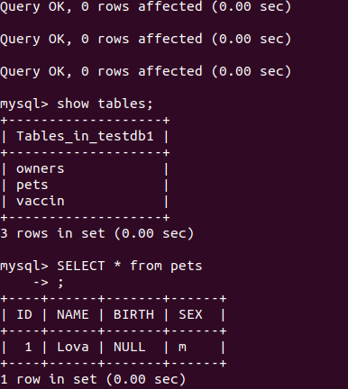
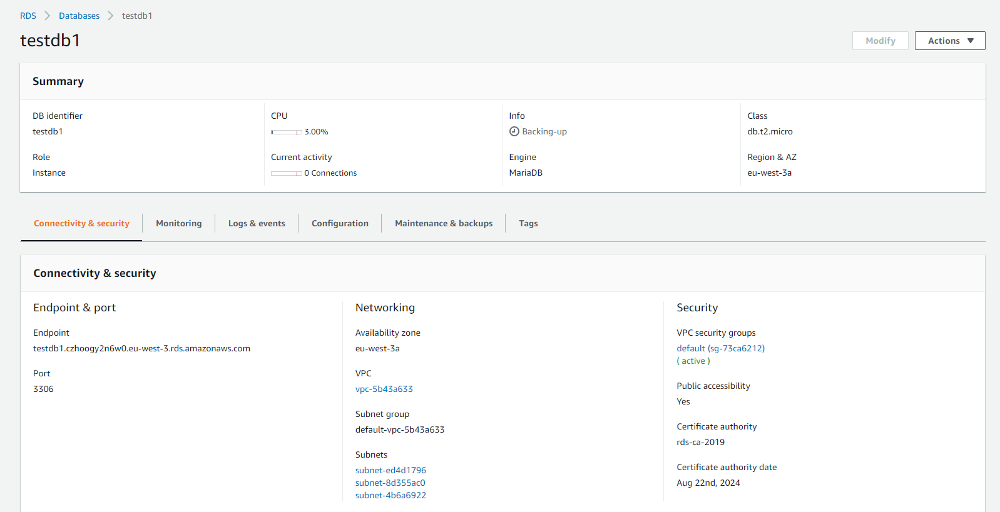
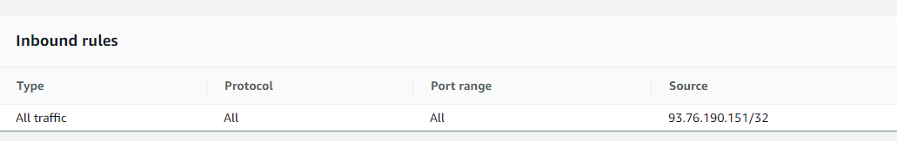
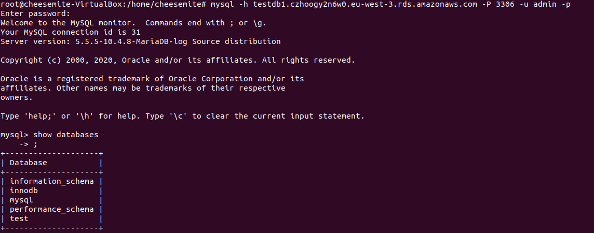
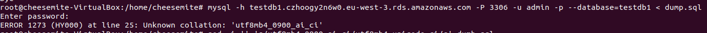
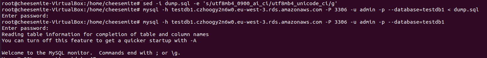
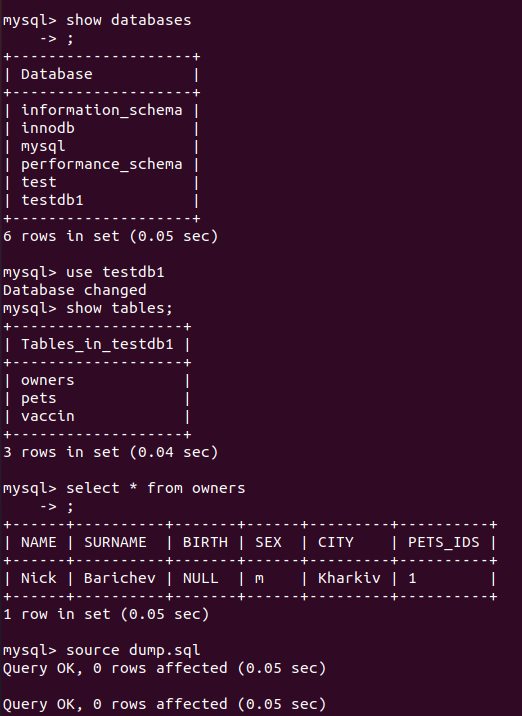

# Task3.2

## Created backup
```console
# mysqldump testdb1 > dump.sql
```

## Deleted table  
  

## Restored info
  

## It works!
  

## Created DB with RDS AWS
  

## Added my IP to inbound rules
  

## Connected to DB
  

## Got an error because of SQL versions incompatibility
  

## Fixed and succesfully transferred data
  

## Results
   
