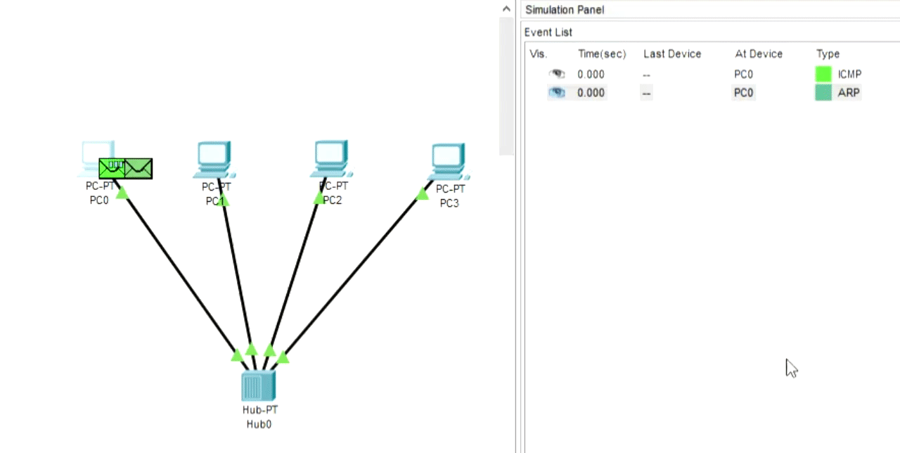
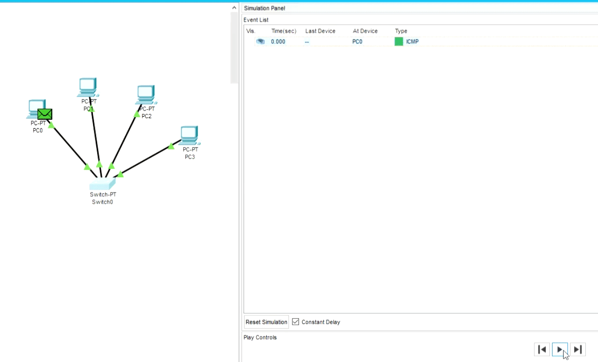
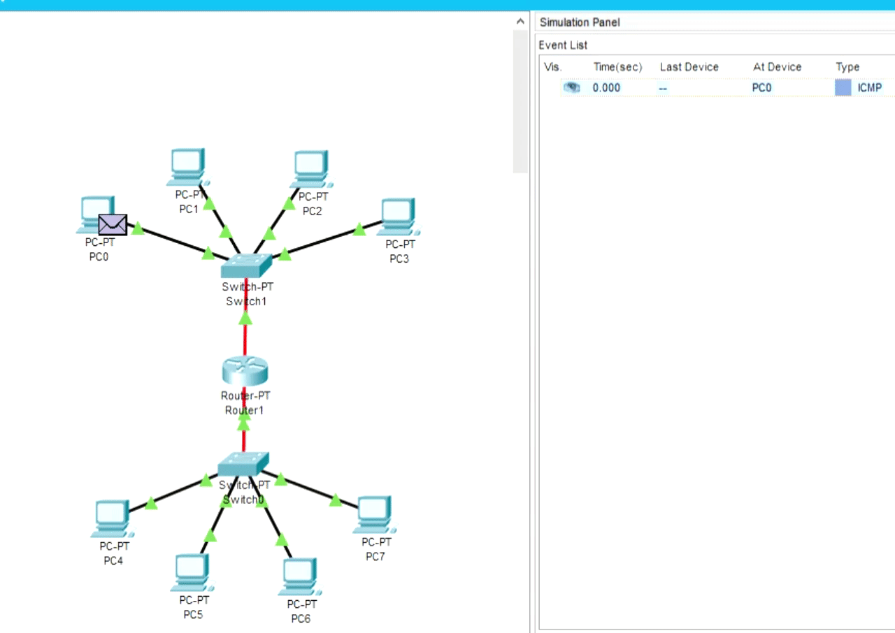

# Task4.1  

* PC can't send a packet having no IP adress  
* Hub is kinda a dumb device sending packets to all ports(except of source), while switch is smarter in some sense, having MAC address table  
* Router provides you with an abitily to connect subnetworks  

##### *arp process is captured for better understanding*  
## *Case 1*  
  
## *Case 2*  

## *Case 3*  
  
## *Case 4*  
  
## *Case 5*  
  

