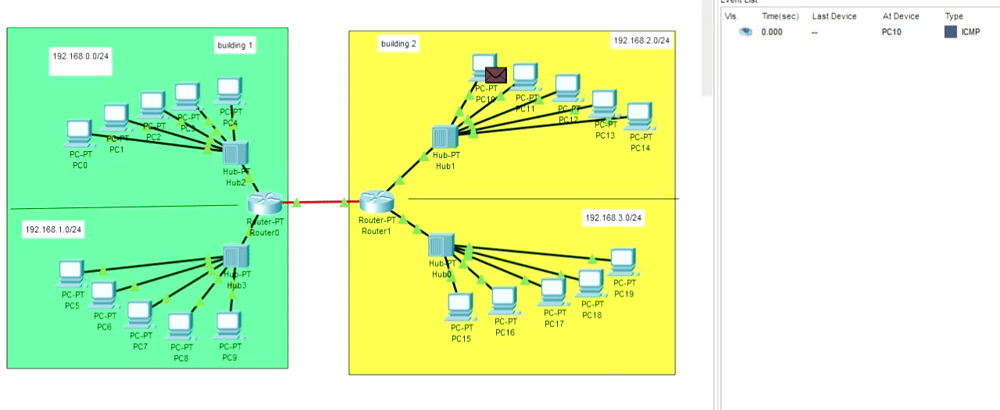
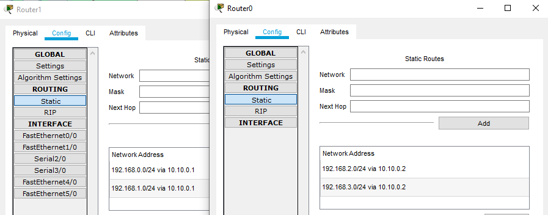
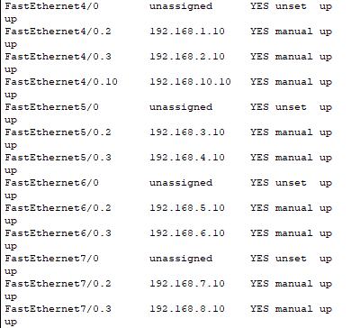
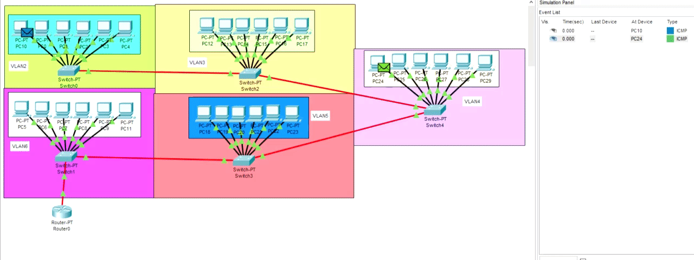
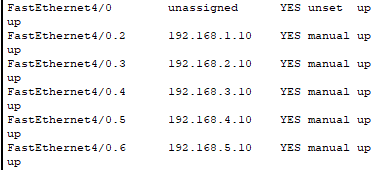

# Task4.2  
## Case 1  
  
* Routers(interfaces) were set as default gateways for PCs  
* Configured static routing for each router  

  
## Case 2  
  
* Created VLANs  
* Created sub-interfaces in router for VLAN purposes (route 2 VLANs by 1 switch, 1 router, **1 router's interface**)  
* Setted trunk mod for switch's ports, connected to router  
* Router(interfaces) was set as default gateway for PCs  

  
## Case 3  
  
* Switches are connected to each other by trunk ports  
* Router connected to switch by trunk port  
* Created sub-interfaces in router for VLAN purposes  

  