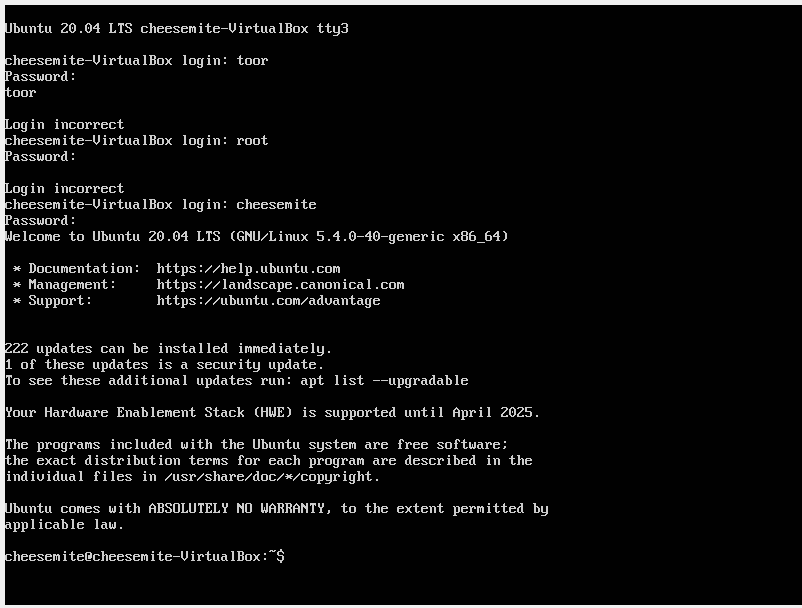
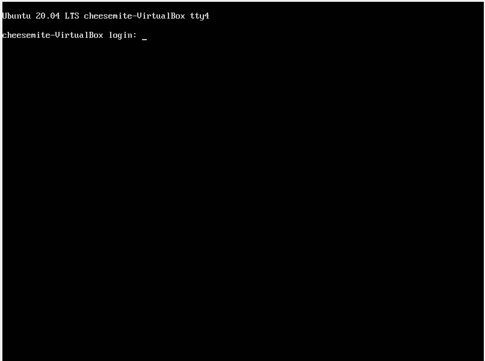
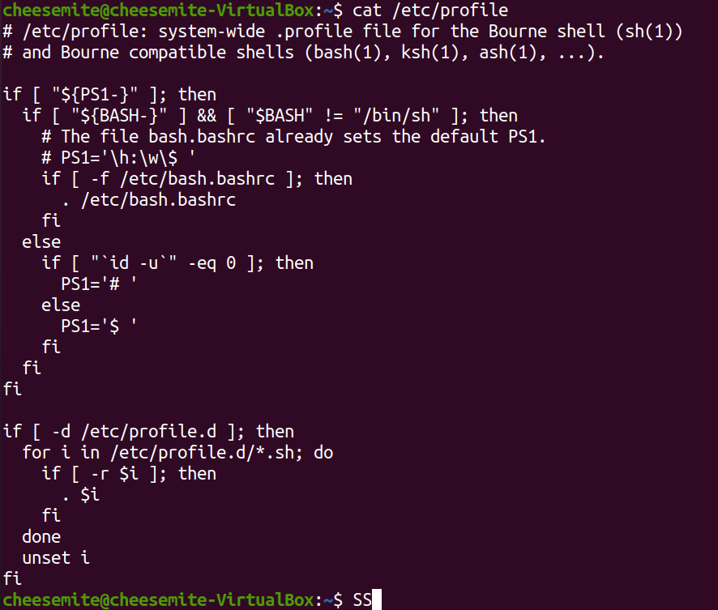
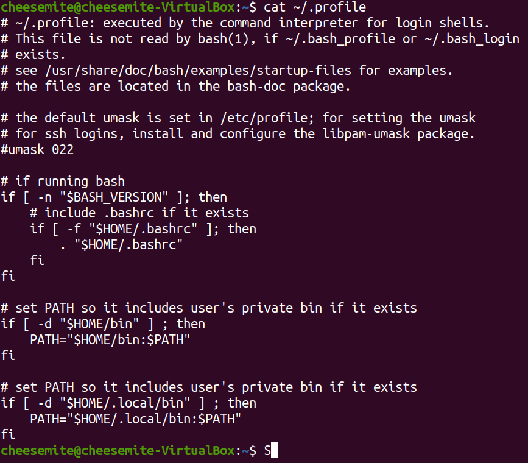
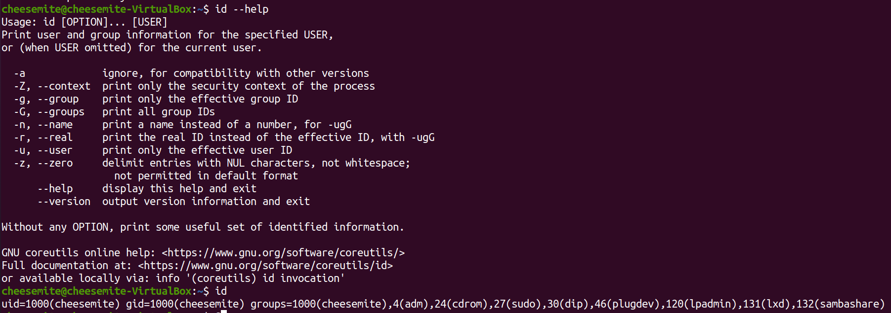
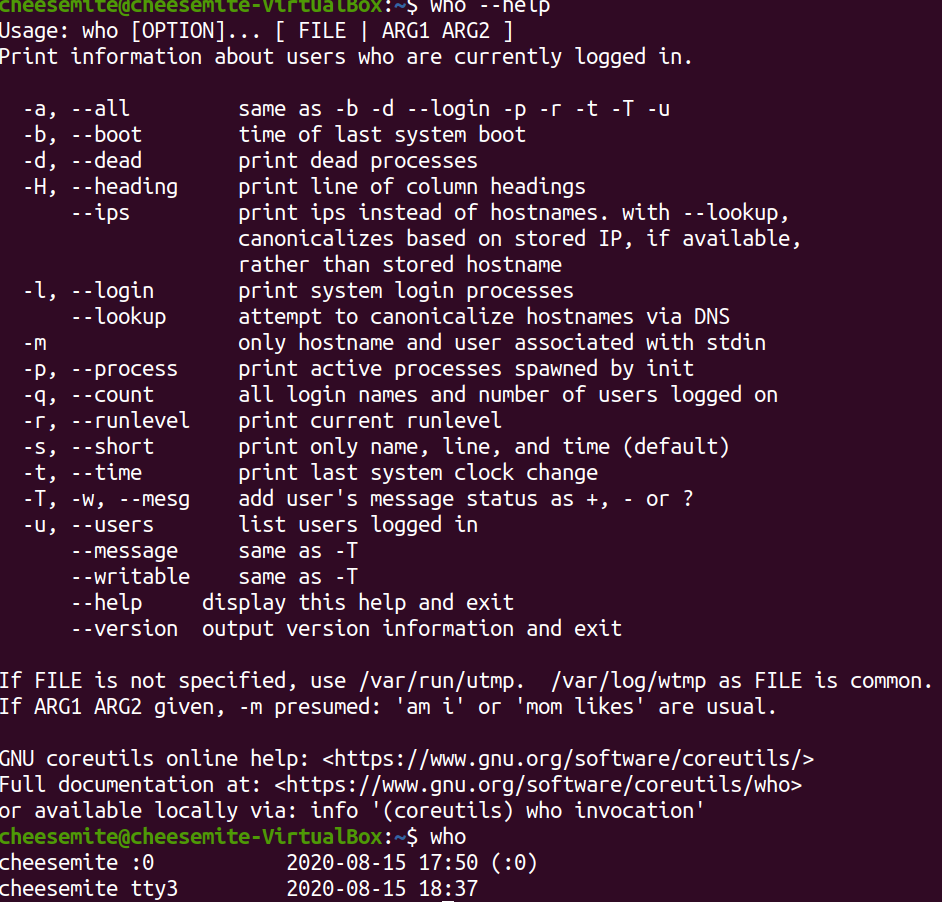
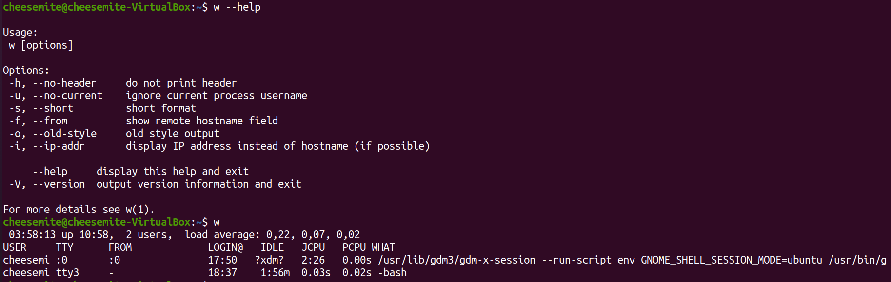
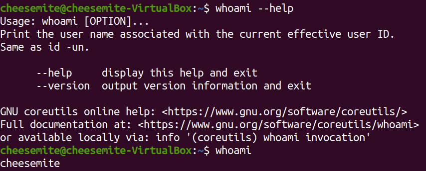
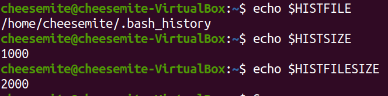

# Task5.1  
Switched to virtual console #3  
  

Switched to virtual console #4  
  

Output of command ```env```
  

***```/etc/profile```***  
  

***```~/.profile```***  
  

***```id```*** command  
  

***```who```*** command  
  

***```w```*** command  
  

***```whoami```*** command  
  

### ***```HISTSIZE/HISTFILESIZE/HISTFILE```***  
  