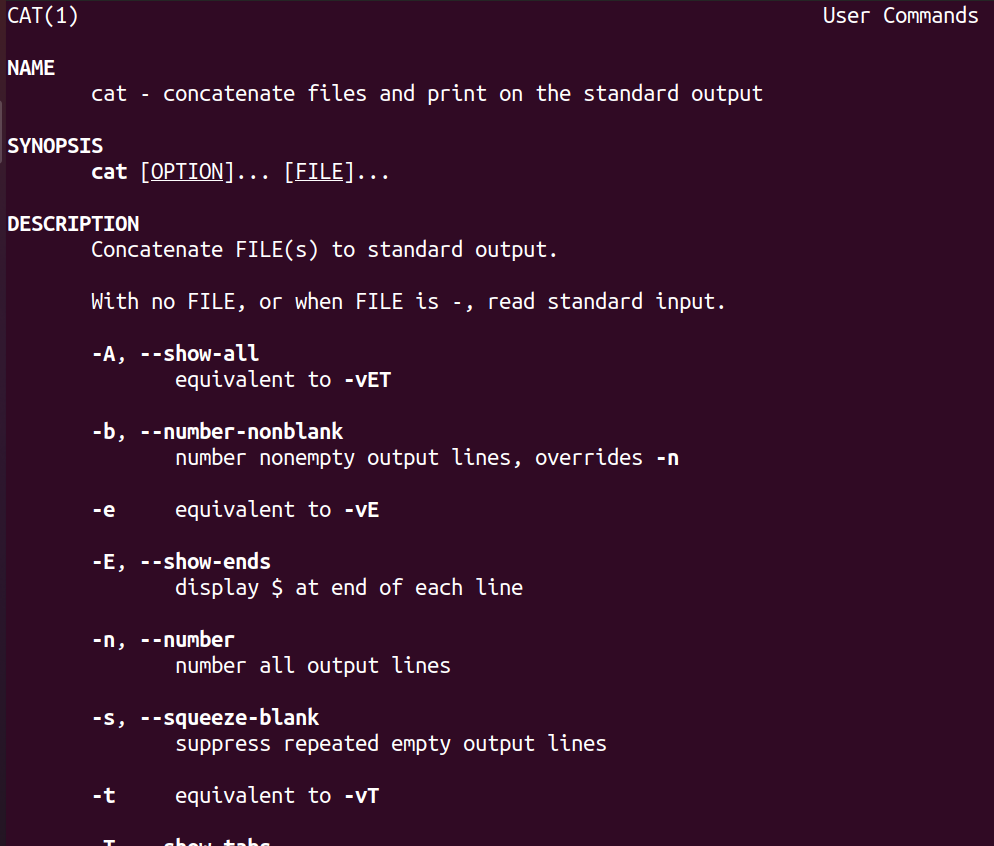

# Task5.2
```console
cheesemite@cheesemite-VirtualBox:~$ pwd
/home/cheesemite
```  
list the files in the / providing detailed info
```console
cheesemite@cheesemite-VirtualBox:~$ ls -l /
total 459344
lrwxrwxrwx   1 root root         7 чер  6 21:40 bin -> usr/bin
drwxr-xr-x   4 root root      4096 сер 16 13:41 boot
drwxrwxr-x   2 root root      4096 чер  6 21:43 cdrom
drwxr-xr-x  19 root root      4080 сер 16 13:40 dev
drwxr-xr-x 130 root root     12288 сер 16 13:46 etc
drwxr-xr-x   3 root root      4096 чер  6 21:44 home
lrwxrwxrwx   1 root root         7 чер  6 21:40 lib -> usr/lib
lrwxrwxrwx   1 root root         9 чер  6 21:40 lib32 -> usr/lib32
lrwxrwxrwx   1 root root         9 чер  6 21:40 lib64 -> usr/lib64
lrwxrwxrwx   1 root root        10 чер  6 21:40 libx32 -> usr/libx32
drwx------   2 root root     16384 чер  6 21:40 lost+found
drwxr-xr-x   4 root root      4096 лип 15 18:10 media
drwxr-xr-x   2 root root      4096 кві 23 10:32 mnt
drwxr-xr-x   3 root root      4096 чер  7 12:25 opt
dr-xr-xr-x 202 root root         0 сер 15 17:00 proc
drwx------   3 root root      4096 лип 15 18:24 root
drwxr-xr-x  31 root root       980 сер 16 13:46 run
lrwxrwxrwx   1 root root         8 чер  6 21:40 sbin -> usr/sbin
drwxr-xr-x   9 root root      4096 чер 20 22:42 snap
drwxr-xr-x   2 root root      4096 кві 23 10:32 srv
-rw-------   1 root root 470287360 чер  6 21:40 swapfile
dr-xr-xr-x  13 root root         0 сер 15 17:00 sys
drwxrwxrwt  18 root root      4096 сер 16 17:13 tmp
drwxr-xr-x  14 root root      4096 кві 23 10:34 usr
drwxr-xr-x  14 root root      4096 кві 23 10:42 var
-rw-------   1 root root         0 сер 15 17:00 VBox.log
```
list the files in the current working directory
```console
cheesemite@cheesemite-VirtualBox:~$ ls
Desktop  Documents  Downloads  env.txt  Music  Pictures  printenv.txt  Public  Templates  Videos
```  
list the files in the home directory  
```console
cheesemite@cheesemite-VirtualBox:~$ ls ~
Desktop  Documents  Downloads  env.txt  Music  Pictures  printenv.txt  Public  Templates  Videos
```
list the files in the current working directory providing detailed info
```console
cheesemite@cheesemite-VirtualBox:~$ ls -l
total 40
drwxr-xr-x 2 cheesemite cheesemite 4096 чер  7 12:18 Desktop
drwxr-xr-x 2 cheesemite cheesemite 4096 чер  7 12:18 Documents
drwxr-xr-x 2 cheesemite cheesemite 4096 чер  7 12:41 Downloads
-rw-rw-r-- 1 cheesemite cheesemite 3213 сер 16 02:29 env.txt
drwxr-xr-x 2 cheesemite cheesemite 4096 чер  7 12:18 Music
drwxr-xr-x 2 cheesemite cheesemite 4096 чер  7 12:18 Pictures
-rw-rw-r-- 1 cheesemite cheesemite 3218 сер 16 02:29 printenv.txt
drwxr-xr-x 2 cheesemite cheesemite 4096 чер  7 12:18 Public
drwxr-xr-x 2 cheesemite cheesemite 4096 чер  7 12:18 Templates
drwxr-xr-x 2 cheesemite cheesemite 4096 чер  7 12:18 Videos
```
list all(even hidden) the files in the current working directory
```console
cheesemite@cheesemite-VirtualBox:~$ ls -a
.              .bashrc  Documents  .lesshst  Pictures      Public                     .vboxclient-clipboard.pid    Videos
..             .cache   Downloads  .local    .pki          .ssh                       .vboxclient-display.pid      .vscode
.bash_history  .config  env.txt    .mozilla  printenv.txt  .sudo_as_admin_successful  .vboxclient-draganddrop.pid
.bash_logout   Desktop  .gnupg     Music     .profile      Templates                  .vboxclient-seamless.pid
```
list all(even hidden) the files in the current working directory providing detailed info
```console
cheesemite@cheesemite-VirtualBox:~$ ls -la
total 116
drwxr-xr-x 18 cheesemite cheesemite 4096 сер 16 02:29 .
drwxr-xr-x  3 root       root       4096 чер  6 21:44 ..
-rw-------  1 cheesemite cheesemite 1038 лип 15 18:24 .bash_history
-rw-r--r--  1 cheesemite cheesemite  220 чер  6 21:44 .bash_logout
-rw-r--r--  1 cheesemite cheesemite 3771 чер  6 21:44 .bashrc
drwxr-xr-x 14 cheesemite cheesemite 4096 сер 15 18:37 .cache
drwxr-xr-x 14 cheesemite cheesemite 4096 лип 15 17:13 .config
drwxr-xr-x  2 cheesemite cheesemite 4096 чер  7 12:18 Desktop
drwxr-xr-x  2 cheesemite cheesemite 4096 чер  7 12:18 Documents
drwxr-xr-x  2 cheesemite cheesemite 4096 чер  7 12:41 Downloads
-rw-rw-r--  1 cheesemite cheesemite 3213 сер 16 02:29 env.txt
drwx------  3 cheesemite cheesemite 4096 чер  7 12:42 .gnupg
-rw-------  1 cheesemite cheesemite   36 чер  7 18:49 .lesshst
drwxr-xr-x  3 cheesemite cheesemite 4096 чер  7 12:18 .local
drwx------  5 cheesemite cheesemite 4096 чер  7 12:21 .mozilla
drwxr-xr-x  2 cheesemite cheesemite 4096 чер  7 12:18 Music
drwxr-xr-x  2 cheesemite cheesemite 4096 чер  7 12:18 Pictures
drwx------  3 cheesemite cheesemite 4096 чер  7 12:42 .pki
-rw-rw-r--  1 cheesemite cheesemite 3218 сер 16 02:29 printenv.txt
-rw-r--r--  1 cheesemite cheesemite  807 чер  6 21:44 .profile
drwxr-xr-x  2 cheesemite cheesemite 4096 чер  7 12:18 Public
drwx------  2 cheesemite cheesemite 4096 чер  7 12:42 .ssh
-rw-r--r--  1 cheesemite cheesemite    0 чер  7 12:35 .sudo_as_admin_successful
drwxr-xr-x  2 cheesemite cheesemite 4096 чер  7 12:18 Templates
-rw-r-----  1 cheesemite cheesemite    5 сер 15 17:50 .vboxclient-clipboard.pid
-rw-r-----  1 cheesemite cheesemite    5 сер 15 17:50 .vboxclient-display.pid
-rw-r-----  1 cheesemite cheesemite    5 сер 15 17:50 .vboxclient-draganddrop.pid
-rw-r-----  1 cheesemite cheesemite    5 сер 15 17:50 .vboxclient-seamless.pid
drwxr-xr-x  2 cheesemite cheesemite 4096 чер  7 12:18 Videos
drwxrwxr-x  3 cheesemite cheesemite 4096 чер  7 12:42 .vscode
```
list home directory providing detailed info
```console
cheesemite@cheesemite-VirtualBox:~$ ls -lda ~
drwxr-xr-x 18 cheesemite cheesemite 4096 сер 16 02:29 /home/cheesemite
```
___  
### Work with ```pwd/mkdir/rmdir/ls/cd/cp/mv```
```console
cheesemite@cheesemite-VirtualBox:~$ mkdir test
cheesemite@cheesemite-VirtualBox:~$ cd test
cheesemite@cheesemite-VirtualBox:~/test$ pwd
/home/cheesemite/test
cheesemite@cheesemite-VirtualBox:~/test$ touch test.txt
cheesemite@cheesemite-VirtualBox:~/test$ ls -l test.txt 
-rw-rw-r-- 1 cheesemite cheesemite 0 сер 16 18:00 test.txt
cheesemite@cheesemite-VirtualBox:~/test$ mkdir test2
cheesemite@cheesemite-VirtualBox:~/test$ mv test.txt test2
cheesemite@cheesemite-VirtualBox:~/test$ cd test2
cheesemite@cheesemite-VirtualBox:~/test/test2$ ls
test.txt
cheesemite@cheesemite-VirtualBox:~/test/test2$ mv test.txt test2.txt
cheesemite@cheesemite-VirtualBox:~/test/test2$ ls
test2.txt
cheesemite@cheesemite-VirtualBox:~/test/test2$ cp test2.txt ..
cheesemite@cheesemite-VirtualBox:~/test/test2$ cd ..
cheesemite@cheesemite-VirtualBox:~/test$ ls
test2  test2.txt
cheesemite@cheesemite-VirtualBox:~/test$ rm test2.txt
cheesemite@cheesemite-VirtualBox:~/test$ rmdir test2
rmdir: failed to remove 'test2': Directory not empty
```
___  
## ```/etc/fstab``` and ```cat/less/more```
```cat``` command outputs contents of file to stdout
```console  
cheesemite@cheesemite-VirtualBox:~$ cat /etc/fstab 
# /etc/fstab: static file system information.
#
# Use 'blkid' to print the universally unique identifier for a
# device; this may be used with UUID= as a more robust way to name devices
# that works even if disks are added and removed. See fstab(5).
#
# <file system> <mount point>   <type>  <options>       <dump>  <pass>
# / was on /dev/sda5 during installation
UUID=8840d0a7-aca4-4758-aec8-80faa467a974 /               ext4    errors=remount-ro 0       1
# /boot/efi was on /dev/sda1 during installation
UUID=3193-7F26  /boot/efi       vfat    umask=0077      0       1
/swapfile                                 none            swap    sw              0       0
```
```less``` is a pager, provides you with an ability to view contents of a text file  
```console
cheesemite@cheesemite-VirtualBox:~$ less /etc/fstab 
```
```more``` is a pager too, but allows only forward navigation  
```console
cheesemite@cheesemite-VirtualBox:~$ more /etc/fstab 
# /etc/fstab: static file system information.
#
# Use 'blkid' to print the universally unique identifier for a
# device; this may be used with UUID= as a more robust way to name devices
# that works even if disks are added and removed. See fstab(5).
#
# <file system> <mount point>   <type>  <options>       <dump>  <pass>
# / was on /dev/sda5 during installation
UUID=8840d0a7-aca4-4758-aec8-80faa467a974 /               ext4    errors=remount-ro 0       1
# /boot/efi was on /dev/sda1 during installation
UUID=3193-7F26  /boot/efi       vfat    umask=0077      0       1
/swapfile                                 none            swap    sw              0       0
```
___
### Some man examples
  

  

  