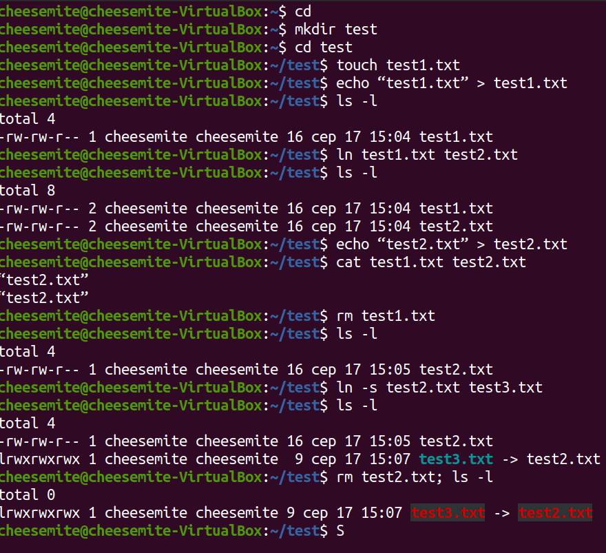

# Task5.3

Contents of ```setuid.txt```  
```console
cheesemite@cheesemite-VirtualBox:~/test$ cat setuid.txt 
-rwsr-xr-x 1 root root 14488 лип  8  2019 /usr/lib/eject/dmcrypt-get-device
-rwsr-sr-x 1 root root 14488 кві  6 12:39 /usr/lib/xorg/Xorg.wrap
-rwsr-xr-- 1 root messagebus 51344 чер 11 21:22 /usr/lib/dbus-1.0/dbus-daemon-launch-helper
-rwsr-xr-x 1 root root 130152 лип 10 16:59 /usr/lib/snapd/snap-confine
-rwsr-xr-x 1 root root 473576 лют 26 12:55 /usr/lib/openssh/ssh-keysign
-rwsr-xr-x 1 root root 22840 сер 16  2019 /usr/lib/policykit-1/polkit-agent-helper-1
-rwsr-xr-- 1 root dip 395144 лип 23 15:39 /usr/sbin/pppd
-rwxr-sr-x 1 root shadow 43160 гру 17  2019 /usr/sbin/unix_chkpwd
-rwxr-sr-x 1 root shadow 43168 гру 17  2019 /usr/sbin/pam_extrausers_chkpwd
-rwsr-xr-x 1 root root 39144 кві  2 18:29 /usr/bin/umount
-rwsr-xr-x 1 root root 68208 кві 16 15:36 /usr/bin/passwd
-rwxr-sr-x 1 root shadow 84512 кві 16 15:36 /usr/bin/chage
-rwxr-sr-x 1 root tty 14488 бер 30 12:26 /usr/bin/bsd-write
-rwsr-xr-x 1 root root 31032 сер 16  2019 /usr/bin/pkexec
-rwsr-xr-x 1 root root 166056 лют  3  2020 /usr/bin/sudo
-rwsr-xr-x 1 root root 55528 кві  2 18:29 /usr/bin/mount
-rwsr-xr-x 1 root root 85064 кві 16 15:36 /usr/bin/chfn
-rwsr-xr-x 1 root root 67816 кві  2 18:29 /usr/bin/su
-rwxr-sr-x 1 root shadow 31312 кві 16 15:36 /usr/bin/expiry
-rwxr-sr-x 1 root tty 35048 кві  2 18:29 /usr/bin/wall
-rwxr-sr-x 1 root ssh 350504 лют 26 12:55 /usr/bin/ssh-agent
-rwxr-sr-x 1 root crontab 43720 лют 13  2020 /usr/bin/crontab
-rwsr-xr-x 1 root root 39144 бер  7 13:09 /usr/bin/fusermount
-rwsr-xr-x 1 root root 88464 кві 16 15:36 /usr/bin/gpasswd
-rwsr-xr-x 1 root root 14560 бер  9 18:10 /usr/bin/vmware-user-suid-wrapper
-rwsr-xr-x 1 root root 44784 кві 16 15:36 /usr/bin/newgrp
-rwsr-xr-x 1 root root 53040 кві 16 15:36 /usr/bin/chsh
-rwxr-sr-x 1 root mail 22856 лип  8 16:44 /usr/libexec/camel-lock-helper-1.2
-rwsr-xr-x 1 root root 5581136 кві 30 13:40 /usr/share/code/chrome-sandbox
-rwsr-xr-x 1 root root 43088 бер  5 19:23 /snap/core18/1880/bin/mount
-rwsr-xr-x 1 root root 64424 чер 28  2019 /snap/core18/1880/bin/ping
-rwsr-xr-x 1 root root 44664 бер 22  2019 /snap/core18/1880/bin/su
-rwsr-xr-x 1 root root 26696 бер  5 19:23 /snap/core18/1880/bin/umount
-rwxr-sr-x 1 root shadow 34816 лют 27  2019 /snap/core18/1880/sbin/pam_extrausers_chkpwd
-rwxr-sr-x 1 root shadow 34816 лют 27  2019 /snap/core18/1880/sbin/unix_chkpwd
-rwxr-sr-x 1 root shadow 71816 бер 22  2019 /snap/core18/1880/usr/bin/chage
-rwsr-xr-x 1 root root 76496 бер 22  2019 /snap/core18/1880/usr/bin/chfn
-rwsr-xr-x 1 root root 44528 бер 22  2019 /snap/core18/1880/usr/bin/chsh
-rwxr-sr-x 1 root shadow 22808 бер 22  2019 /snap/core18/1880/usr/bin/expiry
-rwsr-xr-x 1 root root 75824 бер 22  2019 /snap/core18/1880/usr/bin/gpasswd
-rwsr-xr-x 1 root root 40344 бер 22  2019 /snap/core18/1880/usr/bin/newgrp
-rwsr-xr-x 1 root root 59640 бер 22  2019 /snap/core18/1880/usr/bin/passwd
-rwxr-sr-x 1 root crontab 362640 бер  4  2019 /snap/core18/1880/usr/bin/ssh-agent
-rwsr-xr-x 1 root root 149080 січ 31  2020 /snap/core18/1880/usr/bin/sudo
-rwxr-sr-x 1 root tty 30800 бер  5 19:23 /snap/core18/1880/usr/bin/wall
-rwsr-xr-- 1 root systemd-resolve 42992 чер 11 21:25 /snap/core18/1880/usr/lib/dbus-1.0/dbus-daemon-launch-helper
-rwsr-xr-x 1 root root 436552 бер  4  2019 /snap/core18/1880/usr/lib/openssh/ssh-keysign
-rwsr-xr-x 1 root root 43088 бер  5 19:23 /snap/core18/1885/bin/mount
-rwsr-xr-x 1 root root 64424 чер 28  2019 /snap/core18/1885/bin/ping
-rwsr-xr-x 1 root root 44664 бер 22  2019 /snap/core18/1885/bin/su
-rwsr-xr-x 1 root root 26696 бер  5 19:23 /snap/core18/1885/bin/umount
-rwxr-sr-x 1 root shadow 34816 лют 27  2019 /snap/core18/1885/sbin/pam_extrausers_chkpwd
-rwxr-sr-x 1 root shadow 34816 лют 27  2019 /snap/core18/1885/sbin/unix_chkpwd
-rwxr-sr-x 1 root shadow 71816 бер 22  2019 /snap/core18/1885/usr/bin/chage
-rwsr-xr-x 1 root root 76496 бер 22  2019 /snap/core18/1885/usr/bin/chfn
-rwsr-xr-x 1 root root 44528 бер 22  2019 /snap/core18/1885/usr/bin/chsh
-rwxr-sr-x 1 root shadow 22808 бер 22  2019 /snap/core18/1885/usr/bin/expiry
-rwsr-xr-x 1 root root 75824 бер 22  2019 /snap/core18/1885/usr/bin/gpasswd
-rwsr-xr-x 1 root root 40344 бер 22  2019 /snap/core18/1885/usr/bin/newgrp
-rwsr-xr-x 1 root root 59640 бер 22  2019 /snap/core18/1885/usr/bin/passwd
-rwxr-sr-x 1 root crontab 362640 бер  4  2019 /snap/core18/1885/usr/bin/ssh-agent
-rwsr-xr-x 1 root root 149080 січ 31  2020 /snap/core18/1885/usr/bin/sudo
-rwxr-sr-x 1 root tty 30800 бер  5 19:23 /snap/core18/1885/usr/bin/wall
-rwsr-xr-- 1 root systemd-resolve 42992 чер 11 21:25 /snap/core18/1885/usr/lib/dbus-1.0/dbus-daemon-launch-helper
-rwsr-xr-x 1 root root 436552 бер  4  2019 /snap/core18/1885/usr/lib/openssh/ssh-keysign
-rwsr-xr-x 1 root root 110792 лип 10 21:53 /snap/snapd/8542/usr/lib/snapd/snap-confine
-rwsr-xr-x 1 root root 110792 лип 29 12:20 /snap/snapd/8790/usr/lib/snapd/snap-confine
```
___
```
sudo find / -perm /6000 -type f -exec ls -ld {} \;>setuid.txt
```
```exec``` key is for the command executed for each file found  
```perm``` key is used to find files with certain mode bits  
```type``` key is used to find files with certain type(directories,block devices, character devices, etc.)  

So this version of command searches for the default files with mode bits 6000 and executes command  
```
ls -ld {} \;>setuid.txt
```
for each matched file  
___
## Work with links

___
## ```mount/blkid/dmesh/grep``` and pipes
```console
cheesemite@cheesemite-VirtualBox:~/test$ mount
sysfs on /sys type sysfs (rw,nosuid,nodev,noexec,relatime)
proc on /proc type proc (rw,nosuid,nodev,noexec,relatime)
udev on /dev type devtmpfs (rw,nosuid,noexec,relatime,size=2958036k,nr_inodes=739509,mode=755)
devpts on /dev/pts type devpts (rw,nosuid,noexec,relatime,gid=5,mode=620,ptmxmode=000)
tmpfs on /run type tmpfs (rw,nosuid,nodev,noexec,relatime,size=597240k,mode=755)
/dev/sda5 on / type ext4 (rw,relatime,errors=remount-ro)
securityfs on /sys/kernel/security type securityfs (rw,nosuid,nodev,noexec,relatime)
tmpfs on /dev/shm type tmpfs (rw,nosuid,nodev)
tmpfs on /run/lock type tmpfs (rw,nosuid,nodev,noexec,relatime,size=5120k)
tmpfs on /sys/fs/cgroup type tmpfs (ro,nosuid,nodev,noexec,mode=755)
cgroup2 on /sys/fs/cgroup/unified type cgroup2 (rw,nosuid,nodev,noexec,relatime,nsdelegate)
cgroup on /sys/fs/cgroup/systemd type cgroup (rw,nosuid,nodev,noexec,relatime,xattr,name=systemd)
pstore on /sys/fs/pstore type pstore (rw,nosuid,nodev,noexec,relatime)
none on /sys/fs/bpf type bpf (rw,nosuid,nodev,noexec,relatime,mode=700)
cgroup on /sys/fs/cgroup/pids type cgroup (rw,nosuid,nodev,noexec,relatime,pids)
cgroup on /sys/fs/cgroup/cpu,cpuacct type cgroup (rw,nosuid,nodev,noexec,relatime,cpu,cpuacct)
cgroup on /sys/fs/cgroup/devices type cgroup (rw,nosuid,nodev,noexec,relatime,devices)
cgroup on /sys/fs/cgroup/net_cls,net_prio type cgroup (rw,nosuid,nodev,noexec,relatime,net_cls,net_prio)
cgroup on /sys/fs/cgroup/memory type cgroup (rw,nosuid,nodev,noexec,relatime,memory)
cgroup on /sys/fs/cgroup/hugetlb type cgroup (rw,nosuid,nodev,noexec,relatime,hugetlb)
cgroup on /sys/fs/cgroup/cpuset type cgroup (rw,nosuid,nodev,noexec,relatime,cpuset)
cgroup on /sys/fs/cgroup/perf_event type cgroup (rw,nosuid,nodev,noexec,relatime,perf_event)
cgroup on /sys/fs/cgroup/freezer type cgroup (rw,nosuid,nodev,noexec,relatime,freezer)
cgroup on /sys/fs/cgroup/blkio type cgroup (rw,nosuid,nodev,noexec,relatime,blkio)
cgroup on /sys/fs/cgroup/rdma type cgroup (rw,nosuid,nodev,noexec,relatime,rdma)
systemd-1 on /proc/sys/fs/binfmt_misc type autofs (rw,relatime,fd=28,pgrp=1,timeout=0,minproto=5,maxproto=5,direct,pipe_ino=13287)
mqueue on /dev/mqueue type mqueue (rw,nosuid,nodev,noexec,relatime)
debugfs on /sys/kernel/debug type debugfs (rw,nosuid,nodev,noexec,relatime)
tracefs on /sys/kernel/tracing type tracefs (rw,nosuid,nodev,noexec,relatime)
hugetlbfs on /dev/hugepages type hugetlbfs (rw,relatime,pagesize=2M)
/var/lib/snapd/snaps/gnome-3-28-1804_128.snap on /snap/gnome-3-28-1804/128 type squashfs (ro,nodev,relatime,x-gdu.hide)
/var/lib/snapd/snaps/core18_1880.snap on /snap/core18/1880 type squashfs (ro,nodev,relatime,x-gdu.hide)
/var/lib/snapd/snaps/gnome-3-34-1804_36.snap on /snap/gnome-3-34-1804/36 type squashfs (ro,nodev,relatime,x-gdu.hide)
/var/lib/snapd/snaps/gtk-common-themes_1506.snap on /snap/gtk-common-themes/1506 type squashfs (ro,nodev,relatime,x-gdu.hide)
/var/lib/snapd/snaps/gnome-3-34-1804_24.snap on /snap/gnome-3-34-1804/24 type squashfs (ro,nodev,relatime,x-gdu.hide)
/var/lib/snapd/snaps/snap-store_415.snap on /snap/snap-store/415 type squashfs (ro,nodev,relatime,x-gdu.hide)
fusectl on /sys/fs/fuse/connections type fusectl (rw,nosuid,nodev,noexec,relatime)
/var/lib/snapd/snaps/snap-store_467.snap on /snap/snap-store/467 type squashfs (ro,nodev,relatime,x-gdu.hide)
/var/lib/snapd/snaps/snapd_8542.snap on /snap/snapd/8542 type squashfs (ro,nodev,relatime,x-gdu.hide)
configfs on /sys/kernel/config type configfs (rw,nosuid,nodev,noexec,relatime)
/dev/sda1 on /boot/efi type vfat (rw,relatime,fmask=0077,dmask=0077,codepage=437,iocharset=iso8859-1,shortname=mixed,errors=remount-ro)
/var/lib/snapd/snaps/snapd_8790.snap on /snap/snapd/8790 type squashfs (ro,nodev,relatime,x-gdu.hide)
/var/lib/snapd/snaps/core18_1885.snap on /snap/core18/1885 type squashfs (ro,nodev,relatime,x-gdu.hide)
tmpfs on /run/user/1000 type tmpfs (rw,nosuid,nodev,relatime,size=597236k,mode=700,uid=1000,gid=1000)
gvfsd-fuse on /run/user/1000/gvfs type fuse.gvfsd-fuse (rw,nosuid,nodev,relatime,user_id=1000,group_id=1000)
/dev/fuse on /run/user/1000/doc type fuse (rw,nosuid,nodev,relatime,user_id=1000,group_id=1000)
tracefs on /sys/kernel/debug/tracing type tracefs (rw,nosuid,nodev,noexec,relatime)
binfmt_misc on /proc/sys/fs/binfmt_misc type binfmt_misc (rw,nosuid,nodev,noexec,relatime)
```
```console
cheesemite@cheesemite-VirtualBox:~/test$ blkid
/dev/sda5: UUID="8840d0a7-aca4-4758-aec8-80faa467a974" TYPE="ext4" PARTUUID="473e8c69-05"
```
```console
cheesemite@cheesemite-VirtualBox:~/test$ mount | grep sda
/dev/sda5 on / type ext4 (rw,relatime,errors=remount-ro)
/dev/sda1 on /boot/efi type vfat (rw,relatime,fmask=0077,dmask=0077,codepage=437,iocharset=iso8859-1,shortname=mixed,errors=remount-ro)
```
```console
cheesemite@cheesemite-VirtualBox:~/test$ dmesg | grep sda
[    1.520359] sd 2:0:0:0: [sda] 20971520 512-byte logical blocks: (10.7 GB/10.0 GiB)
[    1.520364] sd 2:0:0:0: [sda] Write Protect is off
[    1.520365] sd 2:0:0:0: [sda] Mode Sense: 00 3a 00 00
[    1.520374] sd 2:0:0:0: [sda] Write cache: enabled, read cache: enabled, doesn't support DPO or FUA
[    1.521716]  sda: sda1 sda2 < sda5 >
[    1.521930] sd 2:0:0:0: [sda] Attached SCSI disk
[    1.972585] EXT4-fs (sda5): mounted filesystem with ordered data mode. Opts: (null)
[    2.503028] EXT4-fs (sda5): re-mounted. Opts: errors=remount-ro
```
```console
cheesemite@cheesemite-VirtualBox:~/test$ sudo grep -R -e "root" /etc > root_entries.txt
[sudo] password for cheesemite: 
grep: /etc/network/if-post-down.d/avahi-daemon: No such file or directory
grep: /etc/pulse/client.conf.d/01-enable-autospawn.conf: No such file or directory
```  
___
fragment of root_entries.txt  
```console
/etc/security/time.conf:# Another silly example, user 'root' is denied xsh access
/etc/security/time.conf:#xsh;ttyp*;root;!WdMo0000-2400
/etc/security/access.conf:# Disallow non-root logins on tty1
/etc/security/access.conf:#-:ALL EXCEPT root:tty1
/etc/security/access.conf:# User "root" should be allowed to get access via cron .. tty5 tty6.
/etc/security/access.conf:#+:root:cron crond :0 tty1 tty2 tty3 tty4 tty5 tty6
/etc/security/access.conf:# User "root" should be allowed to get access from hosts with ip addresses.
/etc/security/access.conf:#+:root:192.168.200.1 192.168.200.4 192.168.200.9
/etc/security/access.conf:#+:root:127.0.0.1
/etc/security/access.conf:# User "root" should get access from network 192.168.201.
/etc/security/access.conf:#+:root:192.168.201.
/etc/security/access.conf:# User "root" should be able to have access from domain.
/etc/security/access.conf:#+:root:.foo.bar.org
/etc/security/access.conf:# User "root" should be denied to get access from all other sources.
/etc/security/access.conf:#-:root:ALL
/etc/security/group.conf:# 1. to run an application as root
/etc/ca-certificates.conf:mozilla/Comodo_AAA_Services_root.crt
/etc/gshadow:root:*::
/etc/nanorc:## In root's .nanorc you might want to use:
/etc/fuse.conf:# Set the maximum number of FUSE mounts allowed to non-root users.
/etc/fuse.conf:# Allow non-root users to specify the allow_other or allow_root mount options.
/etc/rc5.d/S01openvpn:# If openvpn if running under a different user than root we'll need to restart
/etc/rc5.d/S01rsyslog:		chown root:adm $XCONSOLE
```
