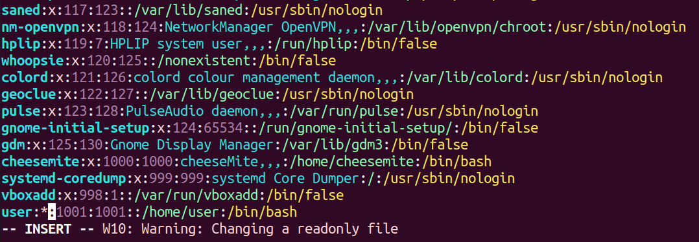
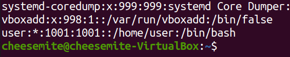
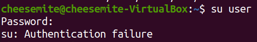
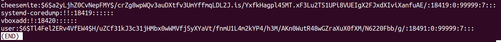
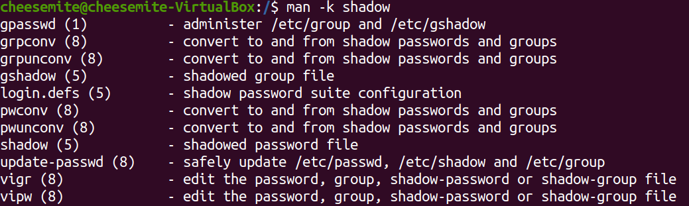
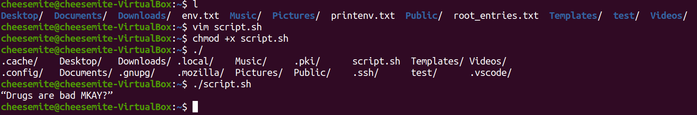
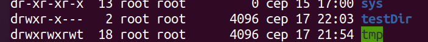
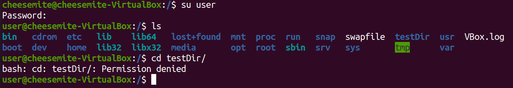
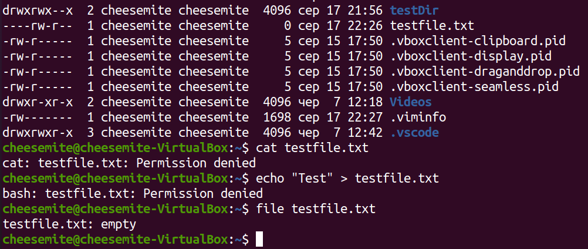

# Task5.4
### Users/Groups
```console
cheesemite@cheesemite-VirtualBox:~$ groupadd user
cheesemite@cheesemite-VirtualBox:~$ useradd -g user -s /bin/bash -d /home/user -m user
cheesemite@cheesemite-VirtualBox:~$ sudo passwd user
[sudo] password for cheesemite: 
New password: 
Retype new password: 
passwd: password updated successfully
cheesemite@cheesemite-VirtualBox:~$ id user
uid=1001(user) gid=1001(user) groups=1001(user)
cheesemite@cheesemite-VirtualBox:~$ ls -ld /home/user
drwxr-xr-x 2 user user 4096 сер 17 18:11 /home/user
```
Logged into the system as user
```console
cheesemite@cheesemite-VirtualBox:~$ su user
Password: 
```
Edited /etc/passwd  
  
result of ```cat /etc/passwd```  
  

try to login?  
  
___
## ```etc/passwd``` and ```etc/group```
```console
cheesemite@cheesemite-VirtualBox:~$ cat /etc/passwd | grep cheesemite
cheesemite:x:1000:1000:cheeseMite,,,:/home/cheesemite:/bin/bash
```
```console
cheesemite@cheesemite-VirtualBox:~$ cat /etc/passwd | grep user
cups-pk-helper:x:113:120:user for cups-pk-helper service,,,:/home/cups-pk-helper:/usr/sbin/nologin
hplip:x:119:7:HPLIP system user,,,:/run/hplip:/bin/false
user:*:1001:1001::/home/user:/bin/bash
```
```console
cheesemite@cheesemite-VirtualBox:~$ cat /etc/passwd | grep root
root:x:0:0:root:/root:/bin/bash
nm-openvpn:x:118:124:NetworkManager OpenVPN,,,:/var/lib/openvpn/chroot:/usr/sbin/nologin
```
```console
cheesemite@cheesemite-VirtualBox:~$ cat /etc/group | grep root
root:x:0:
```
```console
cheesemite@cheesemite-VirtualBox:~$ cat /etc/group | grep cheesemite
adm:x:4:syslog,cheesemite
cdrom:x:24:cheesemite
sudo:x:27:cheesemite
dip:x:30:cheesemite
plugdev:x:46:cheesemite
lpadmin:x:120:cheesemite
lxd:x:131:cheesemite
cheesemite:x:1000:
sambashare:x:132:cheesemite
```
```console
cheesemite@cheesemite-VirtualBox:~$ cat /etc/group | grep user
users:x:100:
user:x:1001:
```
fragment of ```/etc/shadow```
  
```man -k```
  
___
According to the man-page each line of ```/etc/shadow``` consists of 8 fields :
* login
* encrypted pass
* date of last password change
* minimum password age
* maximum password age
* password warning period
* password inactivity period
* account expiration date
___
## Scripts and ```chmod```
  

Changed permissions by this command
```console
cheesemite@cheesemite-VirtualBox:/$ sudo chmod o-wrx testDir/
```
  

  
___
And it's possible to forbid an owner of some file to read from or write to this file.  

  