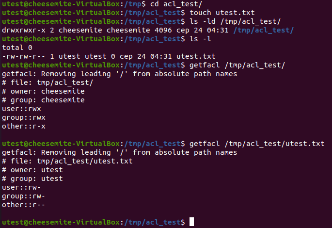

# Task5.6
Checked if disk is mounted with `acl` option  
  

Added utest to cheesemite group  
  

utest can perform operations with(in) acl_test  
  
___  
### Is `ACL` over `chmod`?  
  

  
___  
### Test default `acl`   
  

### Maximum mask
  

Removed all `acl` entries  
  
