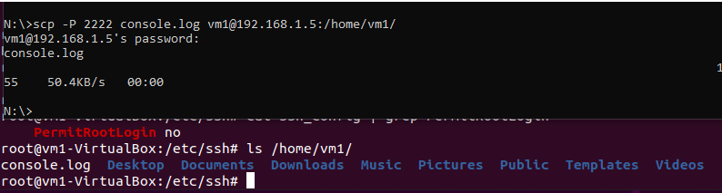
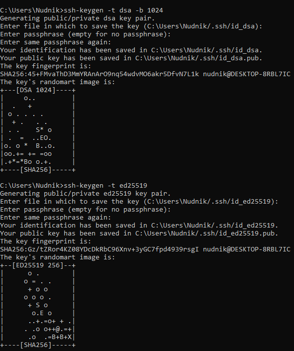
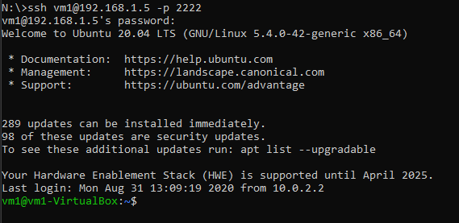
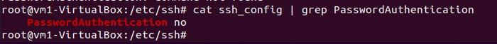
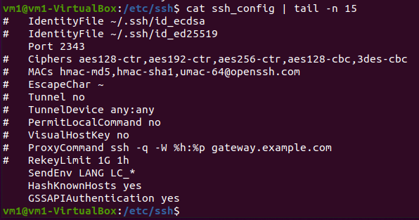
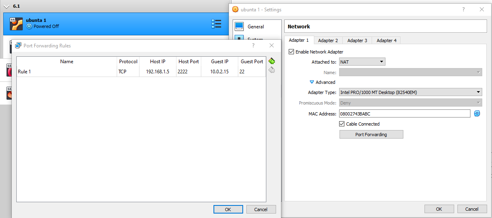
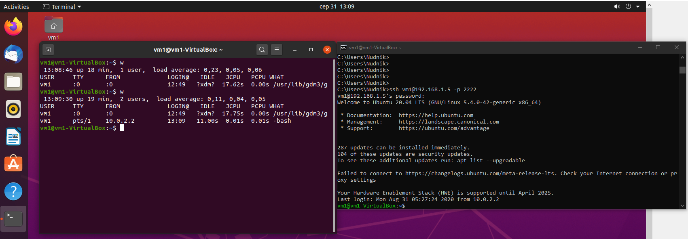

# Task5.7
## Subtask 1
Transfered file by ```scp```  
  
Generated shh-keys by ```ssh-keygen```  
  
Remotly Connected by ```ssh```  
  
___
## Subtask 2
Disabled Root Login by SSH  
  
Disabled Password-Based Logins  
  
Changed port  
  
___
## Subtask 3
Options for encryption :  
* ```-t``` to choose one of the alhorithms(dsa, ecdsa, ed25519, rsa)  
* ```-b``` to choose key size(in bits)  

  
___
## Subtask 4
Set port forwarding  
  
Connected by ssh to the guest OS  
  