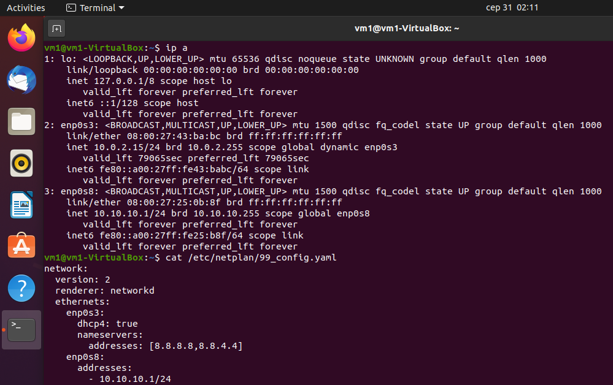

# Task6.1
Configured VMs
#### VM #1
  
  
#### VM #2
  

___
### Configured Network
Enabled forwarding  
  

Set iptables rules  
  

Set netplan config for vm1  
  

Set netplan config for vm2  
  

### Test connection between VM1 and VM2  
  

___
## Subtasks 3-6  
*192.168.1.5 - IP-address of host machine  
  
## Subtask 7  
```ipconfig```   
  

```route PRINT```  
  
## Subtast 8
  
