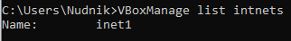
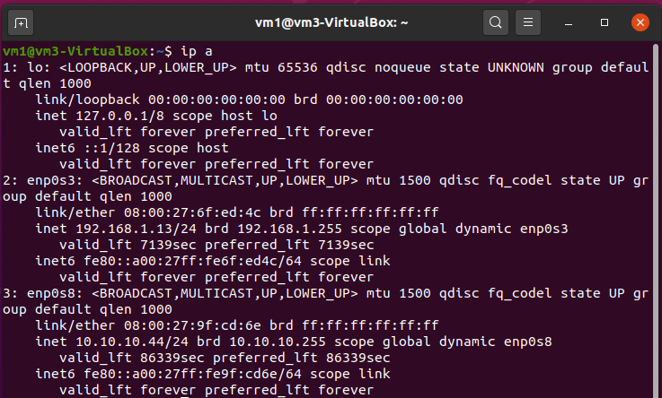

# Task6.2

## Created 3 VMs  
  

## Config of VM1  

  
## Config of VM2  
  
## Config of VM3  
  
  

## Listed internal networks
  
## Created dhcp server
  
### as a result 
  
## vm2 and vm3
  
  
## Disabled systemd-resolved as it conficts with dnsmasq
  
## Configured dnsmasq as dhcp server
  
### it works!  
  
  

## dnsmasq as dns-caching-server
### set iptables rules
  
### configured resolv.cong on vm1  
  
### result on vm2
  