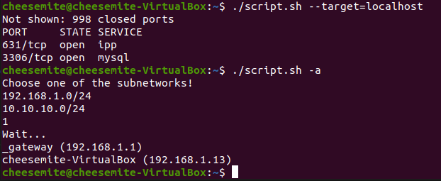

# Task6.3

## using ```nmap```  

```bash
#!/bin/bash

function dislay_opened_tcp {
    result=$(nmap -sT "$1" | tail -n +4 | head -n -2)
    if [ -z  "$result" ] 
    then
        echo "Seems like host is down or IP is wrong!"
    else 
        echo "$result"
    fi
}

function display_subnet_info { 
    inet_info=$(ip -o -f inet addr show | tail -n +2)
    if [ -z "$inet_info" ]  
    then 
        echo "No network interfaces were found!"
        return
    fi
    echo "Choose one of the subnetworks!"
    while IFS= read -r line
    do
        ip=$(echo $line | cut -d ' ' -f4)
        mask=$( echo $ip | tail -c 3)
        subnet=${ip%.*}.0/$mask
        array_of_subnets+=("$subnet")
        echo $subnet
    done < <(echo "$inet_info")
    
    read
    if [ $REPLY -gt 0 ] && [ $REPLY -le ${#array_of_subnets[@]} ] 
    then
        echo "Wait..."
        nmap -sP -R ${array_of_subnets[$(($REPLY-1))]} | grep for | cut -f5,6 -d' '
    else 
        echo "Wrong answer"
    fi
}

if [ -z "$1" ] 
then 
    echo -e "-a --all key displays the IP addresses and symbolic names of all hosts in the current subnet"\
        "\n""-t=[address] --target=[adress] key displays a list of open system TCP ports."
else
    for param in "$*"
    do
        case $param in
        --all|-a) display_subnet_info; 
            ;;
        --target=*|-t=*) dislay_opened_tcp $(echo "$param" |cut -d "=" -f2- ); 
            ;;
        *) echo "wrong key(s)";;
        esac
    done
fi
```
### result
  

## using ```netcat``` and self-made scaner
```
IN PROGRESS
///

```