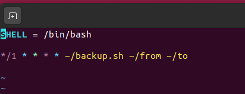
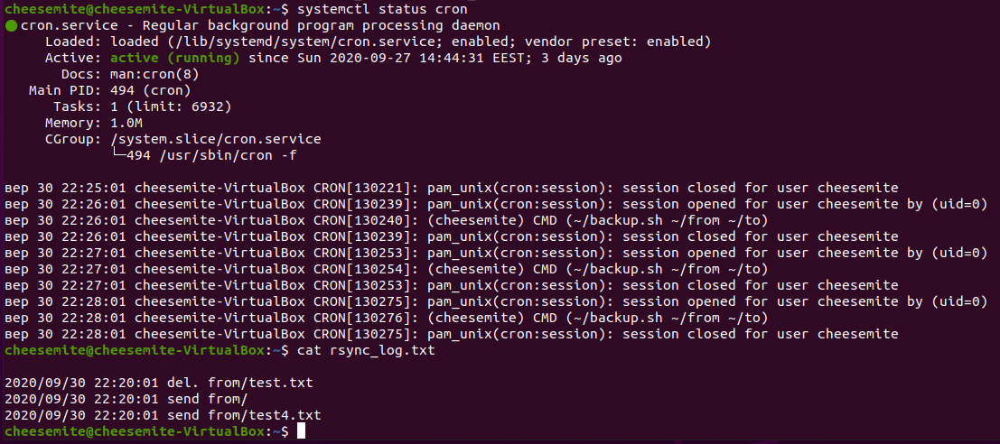

# Task6.5
```bash
#!/bin/bash

if [ ${#*} != 2 ]
then
        echo "2 parametrs must be provided!"
elif ! [ -d "$1" ]
then
        echo "Wrong directory!"
else
        rsync --archive --delete --out-format="%t %o %n" $1 $2 >> ~/rsync_log.txt 2>&1
fi
```
___
## crontab staff
```crontab -e```   

### demo

